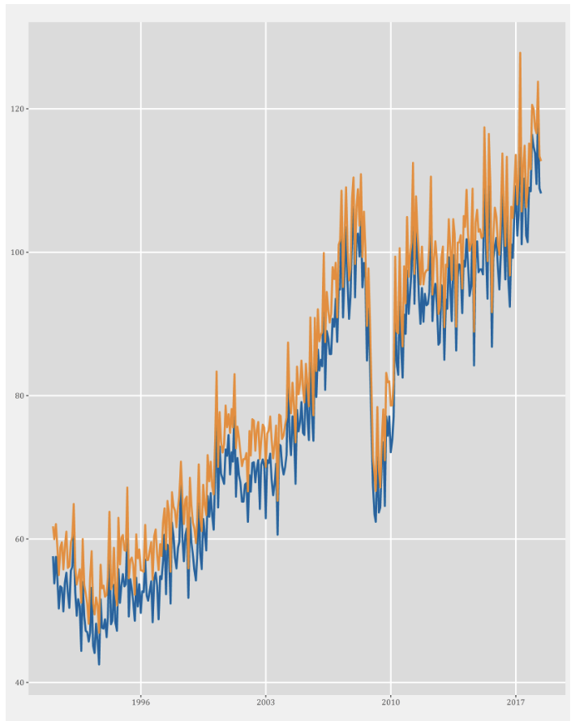
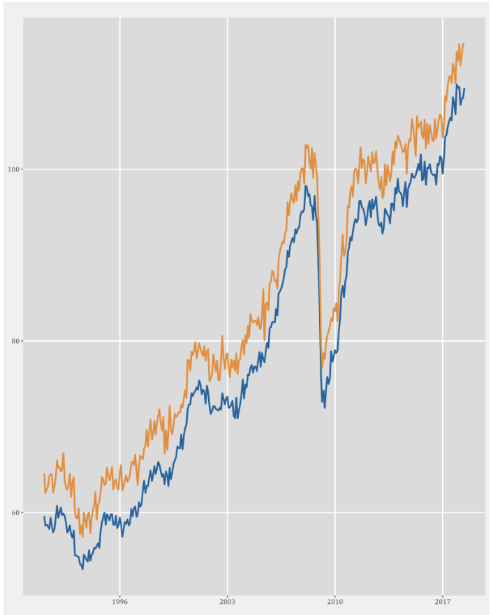

# Deutsche Bundesbank Internship Project 2018

## Extension of EGHL Seasonal Cointegration Test to Monthly Frequency

**A 12-week research project extending the Engle-Granger-Hylleberg-Lee seasonal cointegration test from quarterly to monthly frequency for enhanced analysis of seasonal economic relationships.**

<table>
<tr>
<td></td>
<td></td>
</tr>
</table>

---

## Abstract

This project presents an extension of the Engle-Granger-Hylleberg-Lee (EGHL) seasonal cointegration methodology from quarterly to monthly frequency. The standard EGHL approach, originally designed for quarterly data, tests for cointegration relationships at seasonal frequencies by decomposing the seasonal difference operator into its constituent roots. This work adapts the methodology to handle monthly data by extending the seasonal difference operator to a higher frequency and implementing the corresponding 12 seasonal frequencies.

---

## Repository Structure

```
Deutsche-Bundesbank-Internship-2018-/
├── README.md                          # Project overview (this file)
├── .gitignore                         # Git ignore patterns
│
├── docs/                              # Documentation
│   ├── Documentation.pdf             # Theoretical framework and methodology
│   └── Presentation.pdf              # Project presentation and results
│
├── r_implementation/                  # Original R Implementation
│   └── scoint_monthly.R              # Complete R package (667 lines)
│
├── python_implementation/             # Python Translation
│   ├── scoint_monthly.py             # Main Python implementation (785 lines)
│   └── requirements.txt              # Python dependencies
│
└── examples/                          # Usage Examples
    ├── python_example.py             # Complete Python usage example
    └── data/
        └── sample_data.py            # Sample data generation utilities
```

---

---
---


### Statistical Tests

#### HEGY Test (Individual Series)
- Tests for **seasonal unit roots** at each of the 12 frequencies
- Uses **13 linear filters** for monthly decomposition
- Automatic lag selection based on statistical significance

#### EGHL Test (Cointegration)
- Tests for **seasonal cointegration** between two series
- Uses **8 specialized filters** for cointegration analysis
- Monte Carlo simulation for critical value generation

---

## Applications

The monthly seasonal cointegration test is particularly valuable for:

### 🏖️ **Tourism Economics**
- Seasonal tourism demand relationships between countries/regions
- Monthly visitor flow patterns and expenditure analysis
- Tourism policy impact assessment at monthly frequency

### 🌾 **Agricultural Economics**
- Commodity price relationships with monthly harvest cycles
- Seasonal arbitrage opportunities in agricultural markets
- Food security and price stability analysis

---

## Example Usage

### Python
```python
from python_implementation.scoint_monthly import SeasonalCointegration

# Initialize the test
coint_test = SeasonalCointegration()

# Load your monthly time series data
# x, y = your_monthly_data()

# Run seasonal cointegration test
results = coint_test.scoint(x, y, option="default")

# Display results
results.print_results()
results.summary()
```

### R
```r
source("r_implementation/scoint_monthly.R")

# Load your monthly time series data
# x <- ts(your_data_x, frequency=12)
# y <- ts(your_data_y, frequency=12)

# Run seasonal cointegration test
results <- scoint(x, y, option="default")
print(results)
```

---


